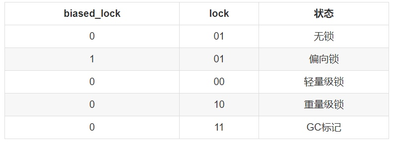
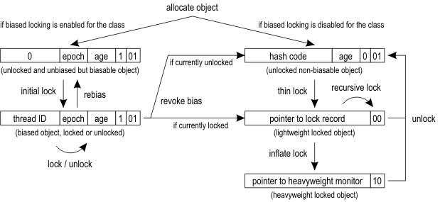
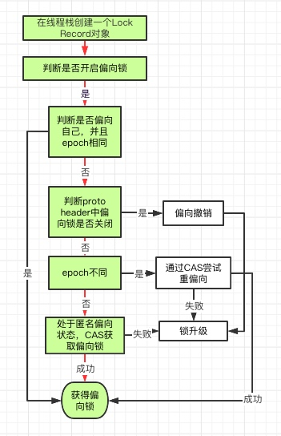
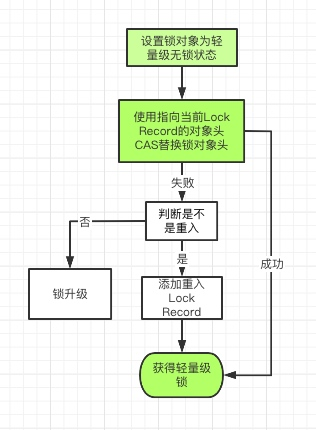
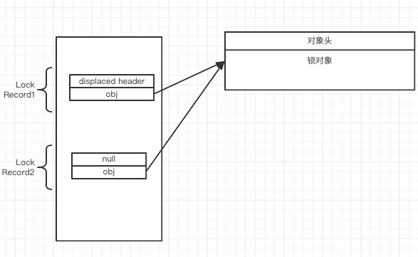

# Java同步机制(一)-Synchronized

[toc]

## Java对象头
锁升级和对象头关系很密切，所以我先了解一下对象头。

我们先来看一下64位系统下对象头的结构，对象头结构分为两部分Mark Word和Klass Word。我们主要关注Mark Word，klass word是指向这个对象的类对象的指针。

```
|--------------------------------------------------------------------------------------------------------------|
|                                              Object Header (128 bits)                                        |
|--------------------------------------------------------------------------------------------------------------|
|                        Mark Word (64 bits)                                    |      Klass Word (64 bits)    |       
|--------------------------------------------------------------------------------------------------------------|
|  unused:25 | identity_hashcode:31 | unused:1 | age:4 | biased_lock:1 | lock:2 |     OOP to metadata object   |  无锁
|----------------------------------------------------------------------|--------|------------------------------|
|  thread:54        |    epoch:2    | unused:1 | age:4 | biased_lock:1 | lock:2 |     OOP to metadata object   |  偏向锁
|----------------------------------------------------------------------|--------|------------------------------|
|                     ptr_to_lock_record:62                            | lock:2 |     OOP to metadata object   |  轻量锁
|----------------------------------------------------------------------|--------|------------------------------|
|                     ptr_to_heavyweight_monitor:62                    | lock:2 |     OOP to metadata object   |  重量锁
|----------------------------------------------------------------------|--------|------------------------------|
|                                                                      | lock:2 |     OOP to metadata object   |    GC
|--------------------------------------------------------------------------------------------------------------|

```

对象头的格式在处于不同锁级别的时候，格式有所不同。
- 无锁状态下，可以保存的数据有对象的hashCode，垃圾回收年龄，偏向标识，锁状态
- 偏向状态下，hashCode会被替换成，线程Id,和epoch，同时还有垃圾回收年龄，偏向标识，锁状态
- 轻量级状态下，保留了锁状态，其他部分都被替换成了指向Lock Record的指针。
- 重量级状态下，指向Lock Record的指针被替换成了指向一个Monitor对象的指针。

这里大家可能会有疑问，在各种锁状态下，都会有部分对象头中的数据被替换成了锁相关的数据，那么被替换的数据都去哪里了呢。
- 偏向锁，hashcode和偏向锁不能共存，在任何情况下调用hashcode，都会导致该锁对象的偏向锁失效。
    - 如果在获得偏向锁之前调用了hashcode，会把对象头中的biased_lock设置为0
    - 如果在获取锁之后的同步代码块中，调用hashcode，则会导致偏向撤销。
- 轻量级锁，会把被替换的对象头整体放到Lock Record中的 displaced_mark_word中
- 重量级锁，会放到monitor对象的_header中。
下面我们主要主要关注一下和锁状态关系比较密切的几个

### biased_lock和lock
- biased_lock这个标志位表示当前这个锁对象是否可以偏向。0表示不可偏向 1表示可偏向。
- lock表示当前锁对象所处的锁级别
 

下面在开启偏向锁，并且过了4秒钟的默认偏向锁生效时间的前提下我们来分析。

- 创建出来的实例的对象头的后三位为`1 01`，并且偏向的线程ID也为空,表示当前的实例状态是`可偏向、没有偏向线程、没有锁定`（也叫做`匿名偏向状态`）
- 当有线程对这个实例加锁，这时候线程会偏向这个线程，既对象头中的线程ID修改为这个线程的ID，后三位为`1 01`,这时候实例状态是，`可偏向，偏向某一线程，没有锁定`(这里为什么认为是没有锁定，我理解，就是把偏向锁也认为是无锁状态)
- 这时候有另一个线程，尝试锁定这个实例，这时候会触发偏向锁的撤销，也就是把对象头中的biased_lock标志位从1改为0，并且升级到轻量级锁。这时候如果之前偏向的线程已经执行完毕，这个线程就能顺利的使用轻量级获得锁。这时候后三位是`0 00`。这时候意思是`不可偏向，已轻量级锁定`
- 这时候如果另一个线程来尝试锁定，并且没有获取成功，会导致锁继续升级为重量级锁。这时候后三位是`0 10`。这时候意思是`不可偏向，已重量级锁定`

### epoch
epoch主要和批量重偏向次数有关，每当这个类型实例，发生了一次批量重偏向，就会把实例所属类型的epoch加1，同时把当前所有正在被线程使用的该类型的锁对象，对象头中的epoch加1，这个操作发生在安全点。
所以如果某些锁对象，如果发生批量重偏向的时候，没有被线程使用，那它的epoch就会小于类型中的epoch，当有线程尝试锁定这个锁对象的时候，则会直接进行一次重偏向。让这个锁对象，偏向当前的线程。

**注意这里是把所有正在被线程使用的锁对象的epoch加1，因为上面重偏向逻辑的存在，所以需要保证正在被某个线程持有的锁对象，不会重新偏向给其他线程。**

下面我就按照偏向锁、轻量级锁、重量级锁的顺序来详细了解一下加锁过程，和其中的关键部分。

## 锁升级整体流程

首先看一下这张图，这是Hotspot官方给出的锁升级过程图，我们先简单分析一下这张图。

1. 开启了偏向锁
    1. 锁对象刚分配的时候默认锁状态是匿名偏向状态。
    2. 有一个线程抢占锁，则在对象头中存储当前线程ID，锁进入偏向状态。
    3. 如果发生了重偏向，则会重新回到匿名偏向状态。
    4. 如果发生了偏向撤销。
        1. 如果发生的时候是无锁状态，则会进入不可偏向的无锁状态。
        2. 如果发生的时候是有线程正持有，则会进入轻量级加锁状态。
        3. 如果还有另一个线程尝试获取，并且获取失败，就会再升级到重量级。
        4. 轻量级和重量级在执行完同步代码之后，锁对象头会回到不可偏向的无锁状态。
    5. 偏向锁执行完同步代码之后，不会修改对象头，仍然保持上次的偏向状态。
2. 没有开启偏向锁，则默认分配的就是不可偏向的无锁状态。
    1. 有线程尝试获取，则直接轻量级锁定
    2. 如果又有另一个线程获取锁，并且轻量级获取失败(也就是上一个线程还没有执行完同步代码)，就会导致锁升级到重量级。
    3. 执行完同步代码，对象头回到初始的不可偏向无锁状态。


## 偏向锁
下面我们从C++的源码来分析一下偏向锁的过程

### 偏向锁加锁
```c++

CASE(_monitorenter): {
        oop lockee = STACK_OBJECT(-1);
        // derefing's lockee ought to provoke implicit null check
        CHECK_NULL(lockee);
        // find a free monitor or one already allocated for this object
        // if we find a matching object then we need a new monitor
        // since this is recursive enter
        BasicObjectLock* limit = istate->monitor_base();
        BasicObjectLock* most_recent = (BasicObjectLock*) istate->stack_base();
        BasicObjectLock* entry = NULL;
        //从当前线程栈中获取一个空闲的BasicObjectLock
        while (most_recent != limit ) {
          if (most_recent->obj() == NULL) entry = most_recent;
          else if (most_recent->obj() == lockee) break;
          most_recent++;
        }
        //获取BasicObjectLock成功
        if (entry != NULL) {
          //将线程栈中的BasicObjectLock的obj指针指向锁对象
          entry->set_obj(lockee);
          int success = false;
          uintptr_t epoch_mask_in_place = (uintptr_t)markOopDesc::epoch_mask_in_place;
          //获取当前锁对象的对象头，用来进行下面的判断
          markOop mark = lockee->mark();
          intptr_t hash = (intptr_t) markOopDesc::no_hash;
          // implies UseBiasedLocking
          //判断锁对象是否是是偏向模式
          if (mark->has_bias_pattern()) {
            uintptr_t thread_ident;
            uintptr_t anticipated_bias_locking_value;
            thread_ident = (uintptr_t)istate->thread();
            //下面这个操作，可以理解为为了方便进行后面的运算，可以说是比较骚的一种玩法，我们可以不用过分关注
            anticipated_bias_locking_value =
              (((uintptr_t)lockee->klass()->prototype_header() | thread_ident) ^ (uintptr_t)mark) &
              ~((uintptr_t) markOopDesc::age_mask_in_place);
            //value = 0 表示已经偏向，并且偏向的就是自己，而且epoch和klass的epoch也相同，什么都不用做，直接获得偏向锁
            if  (anticipated_bias_locking_value == 0) {
              // already biased towards this thread, nothing to do
              if (PrintBiasedLockingStatistics) {
                //如果需要统计偏向锁重入次数，可以使用biased_lock_entry_count_addr统计
                (* BiasedLocking::biased_lock_entry_count_addr())++;
              }
              //标记状态为获取锁成功
              success = true;
            }
            //对象的Klass的对象头不是偏向模式，则撤销偏向
            else if ((anticipated_bias_locking_value & markOopDesc::biased_lock_mask_in_place) != 0) {
              // try revoke bias
              markOop header = lockee->klass()->prototype_header();
              if (hash != markOopDesc::no_hash) {
                header = header->copy_set_hash(hash);
              }
              if (Atomic::cmpxchg_ptr(header, lockee->mark_addr(), mark) == mark) {
                if (PrintBiasedLockingStatistics)
                  (*BiasedLocking::revoked_lock_entry_count_addr())++;
              }
            }
            //当前对象的对象头epoch不等于Klass中的epoch，则尝试重新偏向
            else if ((anticipated_bias_locking_value & epoch_mask_in_place) !=0) {
              // try rebias
              markOop new_header = (markOop) ( (intptr_t) lockee->klass()->prototype_header() | thread_ident);
              if (hash != markOopDesc::no_hash) {
                new_header = new_header->copy_set_hash(hash);
              }
              //进行CAS将对象头中线程Id替换为自己，如果替换成功，则偏向成功
              if (Atomic::cmpxchg_ptr((void*)new_header, lockee->mark_addr(), mark) == mark) {
                if (PrintBiasedLockingStatistics)
                  (* BiasedLocking::rebiased_lock_entry_count_addr())++;
              }
              //替换失败，表示有多个线程并发争抢，则开始锁的升级
              else {
                CALL_VM(InterpreterRuntime::monitorenter(THREAD, entry), handle_exception);
              }
              success = true;
            }
            else {
              //重新偏向， 如果markOop是匿名偏向的时候会偏向当前线程成功
              //走到这里说明当前要么偏向别的线程，要么是匿名偏向（即没有偏向任何线程）
              // try to bias towards thread in case object is anonymously biased
              //构建一个匿名偏向的对象头
              markOop header = (markOop) ((uintptr_t) mark & ((uintptr_t)markOopDesc::biased_lock_mask_in_place |
                                                              (uintptr_t)markOopDesc::age_mask_in_place |
                                                              epoch_mask_in_place));
              if (hash != markOopDesc::no_hash) {
                header = header->copy_set_hash(hash);
              }
              markOop new_header = (markOop) ((uintptr_t) header | thread_ident);
              // debugging hint
              DEBUG_ONLY(entry->lock()->set_displaced_header((markOop) (uintptr_t) 0xdeaddead);)
              //进行CAS替换，如果替换成功，则偏向成功(只有markOop是匿名偏向的时候，才会替换成功)
              if (Atomic::cmpxchg_ptr((void*)new_header, lockee->mark_addr(), header) == header) {
                if (PrintBiasedLockingStatistics)
                  (* BiasedLocking::anonymously_biased_lock_entry_count_addr())++;
              }
              //失败，则升级
              else {
                CALL_VM(InterpreterRuntime::monitorenter(THREAD, entry), handle_exception);
              }
              success = true;
            }
          }

          // traditional lightweight locking
          //轻量级锁
          if (!success) {
            //设置当前的对象头为无锁状态，并且复制到Lock Record中的markoop中
            markOop displaced = lockee->mark()->set_unlocked();
            entry->lock()->set_displaced_header(displaced);
            bool call_vm = UseHeavyMonitors;
            //将对象头中的地址替换为指向Lock Record的指针，替换成功，则说明获取轻量级锁成功,则什么都不做。
            //这里判断，如果是替换失败，则继续判断是否是锁重入。
            if (call_vm || Atomic::cmpxchg_ptr(entry, lockee->mark_addr(), displaced) != displaced) {
              // Is it simple recursive case?
              //这里判断是不是锁重入，判断指向Lock Record的指针指向的地址是否属于当前线程栈
              if (!call_vm && THREAD->is_lock_owned((address) displaced->clear_lock_bits())) {
                //如果是轻量级锁的锁重入,说明前面set_displaced_header设置的是第一个Lock Record的地址，
                //所以要重新将申请的Lock Record的displaced_header置为空,同样也会通过申请的displaced_header的个数来统计轻量级锁的重入次数
                //栈的最高位的Lock Record的displaced_header不是空，重入锁退出锁的时候，会由低到高遍历退出，只在最后一个锁的时候使用CAS替换
                entry->lock()->set_displaced_header(NULL);
              } else {
                //替换失败，则进行锁升级
                CALL_VM(InterpreterRuntime::monitorenter(THREAD, entry), handle_exception);
              }
            }
          }
          UPDATE_PC_AND_TOS_AND_CONTINUE(1, -1);
        } else {
          istate->set_msg(more_monitors);
          UPDATE_PC_AND_RETURN(0); // Re-execute
        }
      }

```
通过代码我们可以知道在偏向锁的获取过程主要进行了几个判断
- 锁本省的偏向模式是否关闭
- 锁的epoch和proto header是否一致并且当前得前程ID和已经偏向的线程ID是否一致
- 锁类型的偏向模式(proto header)是否关闭

具体流程如下
1. 获得一个可用的Lock Record，并把锁对象设置到lock record的obj中。
2. 判断锁对象是否处于偏向模式
    1. 如果不是偏向模式，则直接走轻量级流程
    2. 是偏向模式
        1. 判断是不是已经偏向了当前线程，并且epoch和proto header中相同。并且proto header中也是偏向模式
            1. 如果是，则设置success = true，表示直接获取成功。
        2. 如果不是，则判断proto header中是否关闭了偏向模式
            1. 如果proto header关闭了偏向模式，则构建一个通过proto header构建一个新的对象头，并CAS设置到锁对象头中，完成偏向撤销，然后走轻量级逻辑。`（对象头状态: 偏向模式->撤销偏向）`
        3. 如果没有关闭，则继续判断，是不是epoch不同
            1. 如果是epoch不同，则表示发生了批量重偏向，然后构建一个偏向当前线程的对象头，然后CAS设置到锁对象头。
                1. 如果CAS成功，则设置success = true，表示获取偏向锁成功。`（对象头状态: 偏向其他线程->重新偏向当前线程）`
                2. 如果CAS失败，则表示在这一步发生了线程并发获取锁的操作，则直接调用`monitorenter`锁升级。
        4. 如果都不满足上面的情况，那就是标明，当前锁对象头处于匿名偏向状态，或者偏向了其他线程，那构建一个偏向当前线程的对象头，和匿名偏向的对象头，然后CAS替换到锁对象头中，这里只有锁是匿名偏向状态的时候才会替换成功
            1. 如果设置成功，则设置success= true，表示获取偏向锁成功。`（对象头状态: 匿名偏向->偏向当前线程）`
            2. 如果设置失败，说明锁已经偏向了其他线程，则直接调用`monitorenter`锁升级。
        




### 偏向锁撤销

如果一直只有一个线程持有这个锁，那么这个锁会一直保持偏向状态，并且获取所得操作只需要一次判断，效率最高。
如果一旦出现了另一个线程，尝试获取这个锁对象，就会触发偏向锁的撤销。
偏向撤销，是指把锁对象头中的`bias_lock`修改为0，这样可以让后续的获取锁的步骤中，跳过偏向流程，直接进入轻量级逻辑。
撤销会有三种情况
1. 锁对象处于匿名偏向状态时发起的偏向撤销。比如这个锁对象在没有被任何线程获取之前，调用了hashcode()方法。
2. 持有偏向锁的线程自己发起的偏向撤销，比如在同步方法里调用了hashcode()方法。
3. 一个线程持有偏向锁，另一个线程也尝试获取，导致的偏向撤销。

前两种情况的撤销，不会对任何线程产生影响，所以可以不用等待安全点，直接操作就行。而且第一种，因为没有任何线程获取过它，所以直接使用CAS操作替换就行。
第三种情况，因为直接撤销的话，有可能会对正持有偏向锁的线程产生影响，为了避免这种影响，所以需要在安全点来进行。

下面我们通过代码来分析一下这个过程。
代码的调用过程是

#### fast_enter

```c++ 
//obj 是锁对象
//lock 是线程栈中的 lock record，存储了displaced header
//attempt_rebias 是是否允许重偏向，我们这里是true
void ObjectSynchronizer::fast_enter(Handle obj, BasicLock* lock,
                                    bool attempt_rebias, TRAPS) {
  //判断是否开启偏向锁,如果没开启这走slow_enter升级                                  
  if (UseBiasedLocking) {
     //判断是否是业务线程触发的撤销
    if (!SafepointSynchronize::is_at_safepoint()) {
      BiasedLocking::Condition cond = BiasedLocking::revoke_and_rebias(obj, attempt_rebias, THREAD);
      if (cond == BiasedLocking::BIAS_REVOKED_AND_REBIASED) {
        return;
      }
    } else {
      //这里表示是由vm线程触发的
      assert(!attempt_rebias, "can not rebias toward VM thread");
      BiasedLocking::revoke_at_safepoint(obj);
    }
    assert(!obj->mark()->has_bias_pattern(), "biases should be revoked by now");
  }
  //执行锁升级
  slow_enter(obj, lock, THREAD);
}

```

#### revoke_and_rebias

我们先列举一下这个方法的返回值

- BIAS_REVOKED_AND_REBIASED 偏向撤销并已重偏向
- BIAS_REVOKED 偏向已撤销
- NOT_BIASED 没有偏向

我们看到fast_enter的逻辑中，只要`revoke_and_rebias()`方法返回的不是`BIAS_REVOKED_AND_REBIASED`,那么最终都会执行到`slow_enter`中进行锁升级。

下面我们来看`revoke_and_rebias()`方法的实现。

```c++
BiasedLocking::Condition BiasedLocking::revoke_and_rebias(Handle obj, bool attempt_rebias, TRAPS) {
  assert(!SafepointSynchronize::is_at_safepoint(), "must not be called while at safepoint");

  // We can revoke the biases of anonymously-biased objects
  // efficiently enough that we should not cause these revocations to
  // update the heuristics because doing so may cause unwanted bulk
  // revocations (which are expensive) to occur.
  //获取锁的对象头
  markOop mark = obj->mark();
  //1. 如果不允许重新偏向，并且锁处于匿名偏向
  if (mark->is_biased_anonymously() && !attempt_rebias) {
    // We are probably trying to revoke the bias of this object due to
    // an identity hash code computation. Try to revoke the bias
    // without a safepoint. This is possible if we can successfully
    // compare-and-exchange an unbiased header into the mark word of
    // the object, meaning that no other thread has raced to acquire
    // the bias of the object.
    markOop biased_value       = mark;
    //构建撤销了偏向模式的对象头
    markOop unbiased_prototype = markOopDesc::prototype()->set_age(mark->age());
    //CAS替换锁对象的对象头
    markOop res_mark = (markOop)Atomic::cmpxchg_ptr(unbiased_prototype, obj->mark_addr(), mark);
    //如果替换成功，则撤销完成，然后通过slow_enter进行锁升级即可
    //如果替换失败，说明此时锁已经被其他线程获取，则会通过下面的逻辑走由JVM线程发起的单个撤销
    if (res_mark == biased_value) {
      return BIAS_REVOKED;
    }
    //2. 如果不是匿名偏向，或者是允许重偏向，并且锁对象是偏向模式
    //这里大多数情况是，锁偏向了某个线程。
  } else if (mark->has_bias_pattern()) {
    Klass* k = obj->klass();
    //获取Klass的markOop
    markOop prototype_header = k->prototype_header();
    //2.1. 如果Klass的Oop不是偏向模式则执行
    //表示锁对象所属的类型，已经关闭了偏向模式，发生了批量撤销
    if (!prototype_header->has_bias_pattern()) {
      // This object has a stale bias from before the bulk revocation
      // for this data type occurred. It's pointless to update the
      // heuristics at this point so simply update the header with a
      // CAS. If we fail this race, the object's bias has been revoked
      // by another thread so we simply return and let the caller deal
      // with it.
      markOop biased_value       = mark;
      markOop res_mark = (markOop) Atomic::cmpxchg_ptr(prototype_header, obj->mark_addr(), mark);
      assert(!(*(obj->mark_addr()))->has_bias_pattern(), "even if we raced, should still be revoked");
      return BIAS_REVOKED;
      //2.2 . 如果Klass markOop和锁对象的markOop的epoch不同，则执行
      //这里是说明锁对象仍然处于偏向模式，但是发生了一次批量重偏向，导致epoch不同了
    } else if (prototype_header->bias_epoch() != mark->bias_epoch()) {
      // The epoch of this biasing has expired indicating that the
      // object is effectively unbiased. Depending on whether we need
      // to rebias or revoke the bias of this object we can do it
      // efficiently enough with a CAS that we shouldn't update the
      // heuristics. This is normally done in the assembly code but we
      // can reach this point due to various points in the runtime
      // needing to revoke biases.
      // 如果允许重偏向
      if (attempt_rebias) {
        assert(THREAD->is_Java_thread(), "");
        markOop biased_value       = mark;
        //构建一个偏向当前线程的对象头
        markOop rebiased_prototype = markOopDesc::encode((JavaThread*) THREAD, mark->age(), prototype_header->bias_epoch());
        //cas替换
        markOop res_mark = (markOop) Atomic::cmpxchg_ptr(rebiased_prototype, obj->mark_addr(), mark);
        // 如果替换成功，返回BIAS_REVOKED_AND_REBIASED，表示获取锁成功
        //替换失败，则走下面的偏向撤销流程
        if (res_mark == biased_value) {
          return BIAS_REVOKED_AND_REBIASED;
        }
      } else {
        // 如果不允许重偏向，则进行偏向撤销
        markOop biased_value       = mark;
        markOop unbiased_prototype = markOopDesc::prototype()->set_age(mark->age());
        markOop res_mark = (markOop) Atomic::cmpxchg_ptr(unbiased_prototype, obj->mark_addr(), mark);
        if (res_mark == biased_value) {
          return BIAS_REVOKED;
        }
      }
    }
  }
  //3. 如果锁对象已经偏向了某个线程，而且proto header中偏向模式没有关闭，
  //epoch 也相同的话(也就是偏向了某个线程，但是没有发生批量重偏向和批量撤销)
  //则后走下面的逻辑
  //update_heuristics 这个方法就是决定接下来改进行什么样的操作
  HeuristicsResult heuristics = update_heuristics(obj(), attempt_rebias);
  if (heuristics == HR_NOT_BIASED) {
    return NOT_BIASED;
  } else if (heuristics == HR_SINGLE_REVOKE) {
    //3.1 开始单个撤销
    Klass *k = obj->klass();
    markOop prototype_header = k->prototype_header();
    //当前对象偏向当前线程，并且对象的epoch和Klass的Epoch相同，则直接开始执行撤销，
    //也就是说是线程自己发起的偏向撤销，就是我们上面提到的在同步代码中，调用了hashcode方法
    if (mark->biased_locker() == THREAD &&
        prototype_header->bias_epoch() == mark->bias_epoch()) {
      // A thread is trying to revoke the bias of an object biased
      // toward it, again likely due to an identity hash code
      // computation. We can again avoid a safepoint in this case
      // since we are only going to walk our own stack. There are no
      // races with revocations occurring in other threads because we
      // reach no safepoints in the revocation path.
      // Also check the epoch because even if threads match, another thread
      // can come in with a CAS to steal the bias of an object that has a
      // stale epoch.
      ResourceMark rm;
      if (TraceBiasedLocking) {
        tty->print_cr("Revoking bias by walking my own stack:");
      }
      //因为是自己线程发起的，所以直接进行撤销操作，不需要等待安全点
      BiasedLocking::Condition cond = revoke_bias(obj(), false, false, (JavaThread*) THREAD);
      ((JavaThread*) THREAD)->set_cached_monitor_info(NULL);
      assert(cond == BIAS_REVOKED, "why not?");
      return cond;
    } else {
      //3.2 如果需要撤销的不是当前线程，则需要等待线程安全点，之后Jvm在线程安全点会触发撤销程序
      VM_RevokeBias revoke(&obj, (JavaThread*) THREAD);
      VMThread::execute(&revoke);
      return revoke.status_code();
    }
  }
  //批量撤销和批量重偏向
  assert((heuristics == HR_BULK_REVOKE) ||
         (heuristics == HR_BULK_REBIAS), "?");
  VM_BulkRevokeBias bulk_revoke(&obj, (JavaThread*) THREAD,
                                (heuristics == HR_BULK_REBIAS),
                                attempt_rebias);
  VMThread::execute(&bulk_revoke);
  return bulk_revoke.status_code();
}
```

首先
1. 判断: 是否处于匿名偏向状态，并且不允许重新偏向
    - 这是我们上面说到的撤销的第一种情况，在同步代码块执行前，调用了锁对象的hashcode()方法。
2. 判断：是否锁对象处于偏向模式，包括匿名偏向和偏向了某一个线程
    1. 判断: 是否Class已经关闭了偏向模式
        - 说明发生了偏向撤销
        - 直接使用Class的proto header替换锁对象的对象头，完成撤销操作
    2. 判断: 锁对象和Class的epoch是否不同
        - epoch不同说明，发生了批量重偏向
        - 根据attempt_rebias来处理，如果为true则尝试重偏向，如果为false，则执行偏向撤销     
3. 无法简单的判断如何操作，需要根据Class中记录的偏向撤销信息来进行决策
    - 走到这里条件是:已经偏向了某个线程、Class的偏向模式没有关闭、epoch相同
    - 如果是返回`HR_SINGLE_REVOKE`
        - 判断: 当前线程是否为持有锁线程，并且epoch相同。
            - 这里是我们上面提到的撤销3种情况中的，在同步代码快中调用了hashcode()方法
            - 如果是则直接由当前线程调用`revoke_bias`完成撤销，因为自己发起的，不会导致持有锁线程的异常。
            - 如果不是，则需要交给JVM线程，在安全点调用`revoke_bias`完成撤销。
    - 如果返回的`HR_BULK_REVOKE`和`HR_BULK_REBIAS`，则由JVM线程，在安全点完成批量撤销和批量重偏向。
  
#### update_heuristics

JVM通过这个方法来进行偏向撤销的决策。
先说一下这个决策的数据依据。
- 每个锁对象，发生一次偏向撤销，都会在这个锁对象所属的Class中记录下来，称谓偏向撤销次数
- 每当发生了批量撤销，也会记录下来最近一次发生的时间。
- 用户设置的批量重偏向阈值和批量撤销阈值，新一次批量重偏向延迟时间

```
-XX:BiasedLockingBulkRebiasThreshold=20 偏向锁批量重偏向阈值
-XX:BiasedLockingBulkRevokeThreshold=40 偏向锁批量撤销阈值
```

JVM就是根据上面这些数据来进行计算决策的。

```c++
static HeuristicsResult update_heuristics(oop o, bool allow_rebias) {
  markOop mark = o->mark();
  //如果不是偏向模式直接返回
  if (!mark->has_bias_pattern()) {
    return HR_NOT_BIASED;
  }
 
  // 锁对象的类
  Klass* k = o->klass();
  // 当前时间
  jlong cur_time = os::javaTimeMillis();
  // 上一次批量撤销或者批量重偏向的时间
  // 因为批量撤销和批量重偏向都是同一个方法，所以都会更新这个时间
  jlong last_bulk_revocation_time = k->last_biased_lock_bulk_revocation_time();
  // 该类偏向锁撤销的次数
  int revocation_count = k->biased_lock_revocation_count();
  // BiasedLockingBulkRebiasThreshold是重偏向阈值（默认20），
  //BiasedLockingBulkRevokeThreshold是批量撤销阈值（默认40），
  //BiasedLockingDecayTime是开启一次新的批量重偏向距离上次批量重偏向或者批量撤销后的延迟时间，默认25000。也就是开启批量重偏向后，
  //经过了一段较长的时间（>=BiasedLockingDecayTime），撤销计数器才超过阈值，那我们会重置计数器。
  if ((revocation_count >= BiasedLockingBulkRebiasThreshold) &&
      (revocation_count <  BiasedLockingBulkRevokeThreshold) &&
      (last_bulk_revocation_time != 0) &&
      (cur_time - last_bulk_revocation_time >= BiasedLockingDecayTime)) {
    // This is the first revocation we've seen in a while of an
    // object of this type since the last time we performed a bulk
    // rebiasing operation. The application is allocating objects in
    // bulk which are biased toward a thread and then handing them
    // off to another thread. We can cope with this allocation
    // pattern via the bulk rebiasing mechanism so we reset the
    // klass's revocation count rather than allow it to increase
    // monotonically. If we see the need to perform another bulk
    // rebias operation later, we will, and if subsequently we see
    // many more revocation operations in a short period of time we
    // will completely disable biasing for this type.
    k->set_biased_lock_revocation_count(0);
    revocation_count = 0;
  }

  // 自增撤销计数器
  if (revocation_count <= BiasedLockingBulkRevokeThreshold) {
    revocation_count = k->atomic_incr_biased_lock_revocation_count();
  }
  // 如果达到批量撤销阈值则返回HR_BULK_REVOKE
  if (revocation_count == BiasedLockingBulkRevokeThreshold) {
    return HR_BULK_REVOKE;
  }
  // 如果达到批量重偏向阈值则返回HR_BULK_REBIAS
  if (revocation_count == BiasedLockingBulkRebiasThreshold) {
    return HR_BULK_REBIAS;
  }
  // 没有达到阈值则撤销单个对象的锁
  return HR_SINGLE_REVOKE;
}

```

1. 获取偏向撤销次数、上次批量撤销的时间
2. 然后就是一个比较长的判断
    - 撤销次数大于等于重偏向阈值20，小于批量撤销阈值40，并且发生过重偏向或者批量撤销，并且距离上次发生的时间超过了25000ms，那么我们就把撤销次数清零。
    - 这个判断的意思是，如果一个类型发生过批量操作，但是在接下来的很长时间内，都没有达到下一次批量操作的触发条件，那么JVM就会认为，这个类型的锁对象线程争抢不严重，为了避免它达到批量撤销阈值，从而再也不能使用偏向模式，而把撤销计数归0  
- 然后就是根据撤销计数返回对应的撤销类型了。

#### revoke_bias

update_heuristics 返回对应的撤销决策之后，后面就要根据决策进行具体的处理了。
我们先看单个撤销revoke_bias

``` c++
static BiasedLocking::Condition revoke_bias(oop obj, bool allow_rebias, bool is_bulk, JavaThread* requesting_thread) {
  markOop mark = obj->mark();
  // 如果没有开启偏向模式，则直接返回NOT_BIASED
  if (!mark->has_bias_pattern()) {
    ...
    return BiasedLocking::NOT_BIASED;
  }

  uint age = mark->age();
  // 构建两个mark word，一个是匿名偏向模式（101），一个是无锁模式（001）
  markOop   biased_prototype = markOopDesc::biased_locking_prototype()->set_age(age);
  markOop unbiased_prototype = markOopDesc::prototype()->set_age(age);

  ...

  JavaThread* biased_thread = mark->biased_locker();
  if (biased_thread == NULL) {
     // 匿名偏向。当调用锁对象的hashcode()方法可能会导致走到这个逻辑
     // 这里我也有点疑问，如果是匿名偏向状态，这表示没有被线程获取过，那么在revoke_and_bias的逻辑中应该可以CAS成功，如果那里失败，这里也不会是匿名偏向模式了
     // 如果不允许重偏向，则将对象的mark word设置为无锁模式
    if (!allow_rebias) {
      obj->set_mark(unbiased_prototype);
    }
    ...
    return BiasedLocking::BIAS_REVOKED;
  }

  // code 1：判断偏向线程是否还存活
  bool thread_is_alive = false;
  // 如果当前线程就是偏向线程 
  if (requesting_thread == biased_thread) {
    thread_is_alive = true;
  } else {
     // 遍历当前jvm的所有线程，如果能找到，则说明偏向的线程还存活
    for (JavaThread* cur_thread = Threads::first(); cur_thread != NULL; cur_thread = cur_thread->next()) {
      if (cur_thread == biased_thread) {
        thread_is_alive = true;
        break;
      }
    }
  }
  // 如果偏向的线程已经不存活了
  if (!thread_is_alive) {
    // 允许重偏向则将对象mark word设置为匿名偏向状态，否则设置为无锁状态
    if (allow_rebias) {
      obj->set_mark(biased_prototype);
    } else {
    //如果不允许，就设置为偏向撤销状态
      obj->set_mark(unbiased_prototype);
    }
    ...
    return BiasedLocking::BIAS_REVOKED;
  }

  // 线程还存活则遍历线程栈中所有的Lock Record
  GrowableArray<MonitorInfo*>* cached_monitor_info = get_or_compute_monitor_info(biased_thread);
  BasicLock* highest_lock = NULL;
  for (int i = 0; i < cached_monitor_info->length(); i++) {
    MonitorInfo* mon_info = cached_monitor_info->at(i);
    // 如果能找到对应的Lock Record说明偏向的线程还在执行同步代码块中的代码
    if (mon_info->owner() == obj) {
      ...
      // 需要升级为轻量级锁，直接修改偏向线程栈中的Lock Record。
      //为了处理锁重入的case，在这里将Lock Record的Displaced Mark Word
      //设置为null，第一个Lock Record会在下面的代码中再处理
      markOop mark = markOopDesc::encode((BasicLock*) NULL);
      highest_lock = mon_info->lock();
      highest_lock->set_displaced_header(mark);
    } else {
      ...
    }
  }
  if (highest_lock != NULL) {
    // 修改第一个Lock Record为无锁状态，然后将obj的mark word设置为指向该Lock Record的指针
    highest_lock->set_displaced_header(unbiased_prototype);
    obj->release_set_mark(markOopDesc::encode(highest_lock));
    ...
  } else {
    // 走到这里说明偏向线程已经不在同步块中了
    ...
    if (allow_rebias) {
       //设置为匿名偏向状态
      obj->set_mark(biased_prototype);
    } else {
      // 将mark word设置为无锁状态
      obj->set_mark(unbiased_prototype);
    }
  }

  return BiasedLocking::BIAS_REVOKED;
}

```

上面的撤销逻辑看似比较长，其实核心逻辑并不复杂：

1. 如果当前对象锁已经不是偏向模式了，就不用执行撤销。
2. 如果当前锁对象偏向的线程Id为NULL，也就是没有偏向任何线程，就根据参数allow_rebias判断是否允许重新偏向，不允许就设置锁状态为无锁，相当于撤销偏向。
3. 判断当前锁对象中偏向的线程是否存活，如果持有偏向锁的线程已经死掉了，那如果允许重新偏向就设置对象头锁状态为偏向锁的初始状态，不允许就设置为无锁状态。
4. 如果线程还存活，就开始执行真正的撤销了：

这里回忆一下前面偏向锁的获取和退出流程：偏向锁的获取，就是在当前线程的线程栈中申请一块Lock Record，然后将Lock Record的obj指向锁对象，并且在对象头中存储当前线程的线程Id。而偏向锁的退出，仅仅将Lock Record中的obj值置为空，其他的什么都没有做。
- 如果持有偏向锁的线程依旧存活，这里就有两种情况
（1）持有偏向锁的线程还没有退出同步代码块
（2）第二是持有偏向锁的线程退出了同步代码块。
- 而判断是否已经退出，判断依据就是线程栈中是否还有指向锁对象的Lock Record，这以上面的代码中，首先就是遍历线程栈，判断持有锁的线程是否退出了。
- 遍历结束后，如果highest_lock不等于空，说还没有退出，如果等于NULL说明已经退出了。
- 如果还在代码块中没有退出，就需要升级锁为轻量级锁，升级为轻量级锁业很简单，先将Lock Record的displaced_header设置为无锁的markoop，在把锁对象头替换成指向LockRecord的指针。
- 后面看完轻量级锁，再回过头看这里的升级过程，就会明白了。
- 如果持有偏向锁的线程已经退出了，则判断是否允许重新偏向，如果允许重新偏向，就设置锁对象的对象头为匿名偏向状态。否则设置为轻量级无锁状态，即撤销偏向锁。

### 批量重偏向，批量撤销

> 当只有一个线程A反复进入同步块时，偏向锁带来的性能开销基本可以忽略，但是当线程B尝试获得锁时，就需要等到safe point时交给JVM将偏向锁撤销为无锁状态或升级为轻量级/重量级锁。（因为锁已经被线程A持有，线程B不能修改锁的状态，因为会影响线程A。所以叫给JVM来修改锁的状态）safe point这个词我们在GC中经常会提到，其代表了一个状态，在该状态下所有线程都是暂停的(STW)。总之，偏向锁的撤销是有一定成本的，如果说运行时的场景本身存在多线程竞争的，那偏向锁的存在不仅不能提高性能，而且会导致性能下降。因此，JVM中增加了一种批量重偏向/撤销的机制。

1. 一个线程创建了大量对象并执行了初始的同步操作，之后在另一个线程中将这些对象作为锁进行之后的操作。这种case下，会导致大量的偏向锁撤销操作。
2. 存在明显多线程竞争的场景下使用偏向锁是不合适的，例如生产者/消费者队列。

批量重偏向（bulk rebias）机制是为了解决第一种场景。批量撤销（bulk revoke）则是为了解决第二种场景。
JVM以class为单位，为每个class维护一个偏向锁撤销计数器，每一次该class的对象发生偏向撤销操作时，该计数器+1。然后根据撤销计数器来决定是否触发批量操作，具体逻辑可以查看上面的 `update_heuristics`方法逻辑。

下面我们看代码。
最终批量重偏向和批量撤销都会调用到`bulk_revoke_or_rebias_at_safepoint`方法。

```c++
static BiasedLocking::Condition bulk_revoke_or_rebias_at_safepoint(oop o,
                                                                   bool bulk_rebias,
                                                                   bool attempt_rebias_of_object,
                                                                   JavaThread* requesting_thread) {
  ...
  jlong cur_time = os::javaTimeMillis();
  //记录本次批量操作的时间
  o->klass()->set_last_biased_lock_bulk_revocation_time(cur_time);


  Klass* k_o = o->klass();
  Klass* klass = k_o;

  if (bulk_rebias) {
    // 批量重偏向的逻辑
    if (klass->prototype_header()->has_bias_pattern()) {
      // 拿到类中的epoch
      int prev_epoch = klass->prototype_header()->bias_epoch();
      // code 1：把类中的epoch自增加1
      klass->set_prototype_header(klass->prototype_header()->incr_bias_epoch());
      // 获取到自增后的类epoch
      int cur_epoch = klass->prototype_header()->bias_epoch();

      // code 2：遍历所有线程的栈，更新所有该类型锁实例的epoch
      // 这里很重要，这里是遍历的线程栈，也就是表示是当前正在使用的偏向锁
      //也就是说，这里是找到所有当前正在被线程持有的，或者说正在同步代码块中执行的偏向锁对象
      //然后把它们的epoch和类的epoch保持一致。
      //这么做的目的是，因为线程在获取偏向锁的时候，会比较锁的epoch和类型epoch是否相同
      //如果不同的话，会进行重偏向操作。所以为了避免，当前正在使用的锁，别其他线程获取，
      //所以这里会把当前正在使用的锁，和类的epoch保持一致
      for (JavaThread* thr = Threads::first(); thr != NULL; thr = thr->next()) {
        GrowableArray<MonitorInfo*>* cached_monitor_info = get_or_compute_monitor_info(thr);
        for (int i = 0; i < cached_monitor_info->length(); i++) {
          MonitorInfo* mon_info = cached_monitor_info->at(i);
          oop owner = mon_info->owner();
          markOop mark = owner->mark();
          if ((owner->klass() == k_o) && mark->has_bias_pattern()) {
            // We might have encountered this object already in the case of recursive locking
            assert(mark->bias_epoch() == prev_epoch || mark->bias_epoch() == cur_epoch, "error in bias epoch adjustment");
            owner->set_mark(mark->set_bias_epoch(cur_epoch));
          }
        }
      }
    }

    // 接下来对当前锁对象进行重偏向
    //没错这里也是调用的 revoke_bias,不过第三个参数 is_bulk 为true
    revoke_bias(o, attempt_rebias_of_object && klass->prototype_header()->has_bias_pattern(), true, requesting_thread);
  } else {
    ...

    // code 3：批量撤销的逻辑，将类中的偏向标记关闭，markOopDesc::prototype()返回的是一个关闭偏向模式的prototype
    klass->set_prototype_header(markOopDesc::prototype());

    // code 4：遍历所有线程的栈，撤销该类所有锁的偏向
    //这里和上面批量重偏向一样，撤销的也是当前被使用的锁对象
    for (JavaThread* thr = Threads::first(); thr != NULL; thr = thr->next()) {
      GrowableArray<MonitorInfo*>* cached_monitor_info = get_or_compute_monitor_info(thr);
      for (int i = 0; i < cached_monitor_info->length(); i++) {
        MonitorInfo* mon_info = cached_monitor_info->at(i);
        oop owner = mon_info->owner();
        markOop mark = owner->mark();
        // 判断锁是否该类型的，并且开启了偏向模式
        if ((owner->klass() == k_o) && mark->has_bias_pattern()) {
          //执行偏向撤销，并且allow_rebias 为false，is_bulk 为true
          revoke_bias(owner, false, true, requesting_thread);
        }
      }
    }

    // 撤销当前锁对象的偏向模式
    revoke_bias(o, false, true, requesting_thread);
  }

  ...
  
  BiasedLocking::Condition status_code = BiasedLocking::BIAS_REVOKED;

  //在执行完批量操作后，如果允许重偏向，并且锁对象和类都处于偏向模式
  //那么就让这个锁对象直接重偏向到当前线程，因为这里是安全点，所以直接设置即可，不需要考虑并发。
  if (attempt_rebias_of_object &&
      o->mark()->has_bias_pattern() &&
      klass->prototype_header()->has_bias_pattern()) {
    // 构造一个偏向请求线程的mark word
    markOop new_mark = markOopDesc::encode(requesting_thread, o->mark()->age(),
                                           klass->prototype_header()->bias_epoch());
    // 更新当前锁对象的mark word
    o->set_mark(new_mark);
    status_code = BiasedLocking::BIAS_REVOKED_AND_REBIASED;
    ...
  }

  ...

  return status_code;
}

```

这个方法的整体逻辑还是比较清晰的。
- 首先记录本次批量操作的时间
- 然后根据类型是批量重偏向还是批量撤销
- 然后都是遍历所有的线程栈，找到仍然在使用的锁对象
    - 重偏向的修改epoch，然后执行偏向撤销
    - 批量撤销的，就执行偏向撤销
- 批量操作完成之后，如果锁对象和class仍然处于偏向模式，并且是允许重偏向的，那么就把锁对象偏向到当前线程。


### 偏向锁释放

``` c++
CASE(_monitorexit): {
        oop lockee = STACK_OBJECT(-1);
        CHECK_NULL(lockee);
        // derefing's lockee ought to provoke implicit null check
        // find our monitor slot
        BasicObjectLock* limit = istate->monitor_base();
        BasicObjectLock* most_recent = (BasicObjectLock*) istate->stack_base();
        //循环遍历线程栈中的Lock Record
        while (most_recent != limit ) {
           //如果Lock Record的Obj指向的是当前锁对象，说明是当前锁对象的Lock Record
          if ((most_recent)->obj() == lockee) {
            BasicLock* lock = most_recent->lock();
            markOop header = lock->displaced_header();
            //将obj设置为Null
            most_recent->set_obj(NULL);
            //如果不是偏向模式（即是轻量级锁）,下面是轻量级模式。
            if (!lockee->mark()->has_bias_pattern()) {
              bool call_vm = UseHeavyMonitors;
              // If it isn't recursive we either must swap old header or call the runtime
              if (header != NULL || call_vm) {
                //将对象头中的markoop替换为Lock Record中的markoop
                if (call_vm || Atomic::cmpxchg_ptr(header, lockee->mark_addr(), lock) != lock) {
                  // restore object for the slow case
                  //如果替换失败，则还原Lock Record，并且执行锁升级的monitorexit
                  most_recent->set_obj(lockee);
                  CALL_VM(InterpreterRuntime::monitorexit(THREAD, most_recent), handle_exception);
                }
              }
            }
            UPDATE_PC_AND_TOS_AND_CONTINUE(1, -1);
          }
          most_recent++;
        }
        // Need to throw illegal monitor state exception
        CALL_VM(InterpreterRuntime::throw_illegal_monitor_state_exception(THREAD), handle_exception);
        ShouldNotReachHere();
      }

```

- 遍历当前线程栈中的所有的Lock Record， 如果Lock Record的obj指向的是自己，则说明当前的Lock Record属于当前锁对象。
- 将Lock Record的obj设置为空。如果是偏向锁，则就不做其他操作了。
- 如果是轻量级锁，后面再说明。


### HashCode和偏向锁
在上面时，我们提到当调用hashCode的时候，会引起偏向撤销，那么下面我们就根据代码具体分析一下。
hashCode是本地native方法，实现最终调用是synchronizer.cpp中的ObjectSynchronizer::FastHashCode

```c++

intptr_t ObjectSynchronizer::FastHashCode(Thread * Self, oop obj) {
  //首先就判断了JVM是否启用了偏向锁（这个由参数配置），
  if (UseBiasedLocking) {
    // NOTE: many places throughout the JVM do not expect a safepoint
    // to be taken here, in particular most operations on perm gen
    // objects. However, we only ever bias Java instances and all of
    // the call sites of identity_hash that might revoke biases have
    // been checked to make sure they can handle a safepoint. The
    // added check of the bias pattern is to avoid useless calls to
    // thread-local storage.
    if (obj->mark()->has_bias_pattern()) {
      // Handle for oop obj in case of STW safepoint
      Handle hobj(Self, obj);
      // Relaxing assertion for bug 6320749.
      assert(Universe::verify_in_progress() ||
             !SafepointSynchronize::is_at_safepoint(),
             "biases should not be seen by VM thread here");
      //然后判断当前是否是偏向模式（即偏向还没有被撤销），
      //如果都是，则撤销偏向模式
      BiasedLocking::revoke_and_rebias(hobj, false, JavaThread::current());
      obj = hobj();
      assert(!obj->mark()->has_bias_pattern(), "biases should be revoked by now");
    }
  }

  // hashCode() is a heap mutator ...
  // Relaxing assertion for bug 6320749.
  assert(Universe::verify_in_progress() || DumpSharedSpaces ||
         !SafepointSynchronize::is_at_safepoint(), "invariant");
  assert(Universe::verify_in_progress() || DumpSharedSpaces ||
         Self->is_Java_thread() , "invariant");
  assert(Universe::verify_in_progress() || DumpSharedSpaces ||
         ((JavaThread *)Self)->thread_state() != _thread_blocked, "invariant");

  ObjectMonitor* monitor = NULL;
  markOop temp, test;
  intptr_t hash;
  markOop mark = ReadStableMark(obj);

  // object should remain ineligible for biased locking
  assert(!mark->has_bias_pattern(), "invariant");

  //无锁状态
  //当在同步方法执行之前，调用hashcode,那么会进入这里
  //这里会先去对象头中拿hash，如果为空，则重新计算hash，并设置到一个对象头中
  if (mark->is_neutral()) {
    hash = mark->hash();              // this is a normal header
    if (hash) {                       // if it has hash, just return it
      return hash;
    }
    hash = get_next_hash(Self, obj);  // allocate a new hash code
    temp = mark->copy_set_hash(hash); // merge the hash code into header
    // use (machine word version) atomic operation to install the hash
    // 如果设置成功则返回计算的hashcode
    test = (markOop) Atomic::cmpxchg_ptr(temp, obj->mark_addr(), mark);
    if (test == mark) {
      return hash;
    }
    // If atomic operation failed, we must inflate the header
    // into heavy weight monitor. We could add more code here
    // for fast path, but it does not worth the complexity.
  //这种是重量级锁的情况下，hash存储在monitor中
  } else if (mark->has_monitor()) {
    monitor = mark->monitor();
    temp = monitor->header();
    assert(temp->is_neutral(), "invariant");
    hash = temp->hash();
    if (hash) {
      return hash;
    }
    // Skip to the following code to reduce code size

    //如果是轻量级锁
  } else if (Self->is_lock_owned((address)mark->locker())) {
    temp = mark->displaced_mark_helper(); // this is a lightweight monitor owned
    assert(temp->is_neutral(), "invariant");
    hash = temp->hash();              // by current thread, check if the displaced
    if (hash) {                       // header contains hash code
      return hash;
    }
    // WARNING:
    //   The displaced header is strictly immutable.
    // It can NOT be changed in ANY cases. So we have
    // to inflate the header into heavyweight monitor
    // even the current thread owns the lock. The reason
    // is the BasicLock (stack slot) will be asynchronously
    // read by other threads during the inflate() function.
    // Any change to stack may not propagate to other threads
    // correctly.
  }

  // Inflate the monitor to set hash code
  // 到这儿，说明没有获取到hashCode，首先直接将锁膨胀为轻量级锁，然后获取hashcode并且设置hsahcode
  monitor = ObjectSynchronizer::inflate(Self, obj);
  // Load displaced header and check it has hash code
  mark = monitor->header();
  assert(mark->is_neutral(), "invariant");
  hash = mark->hash();
  if (hash == 0) {
    hash = get_next_hash(Self, obj);
    temp = mark->copy_set_hash(hash); // merge hash code into header
    assert(temp->is_neutral(), "invariant");
    test = (markOop) Atomic::cmpxchg_ptr(temp, monitor, mark);
    if (test != mark) {
      // The only update to the header in the monitor (outside GC)
      // is install the hash code. If someone add new usage of
      // displaced header, please update this code
      hash = test->hash();
      assert(test->is_neutral(), "invariant");
      assert(hash != 0, "Trivial unexpected object/monitor header usage.");
    }
  }
  // We finally get the hash
  return hash;

```

这里的操作


### 关于偏向撤销的思考
>其实这里我也一直有一个疑问，就是在很多情况下，直接重偏向应该是一个更好的选择，那为什么每次都要先进行偏向撤销？


首先我们先明确一个问题，偏向锁比轻量级锁快在哪里？
快在了少一次CAS的操作，偏向锁在偏向之后，如果是同一个线程尝试加锁，只需要一次比较操作，就能加锁成功。

如果按照上面设想的，当一个线程尝试锁定一个已经偏向另一个线程的锁对象的时候，直接进行重偏向，那么这时候需要进行的操作就是
- 判断是不是偏向状态
- 判断是不是偏向的线程
- CAS替换偏向线程ID
这样的话，就损失掉了偏向锁相对于轻量级锁的优势。而且和轻量级锁没有什么太大的区别。甚至还要比直接使用轻量级锁还多了几次比较。

所以JVM在遇到有多个线程尝试锁定同一个对象的时候，会直接锁升级。
所以有就有说到了上面的提到的不同锁，使用场景问题。
让偏向锁只工作在自己最优的没有线程竞争的环境下，从而达到最佳的性能。

## 轻量级锁过程

### 轻量级获取
当上面的偏向锁获取失败的时候，会升级到轻量级锁。
这时候锁对象的对象头格式也会发生相应的变化，在锁对象的对象头中，会存储一个指向持有锁的线程的线程栈中的一个Lock Record的指针。
被Lock Record指针锁顶替的对象头中其他字段的信息，为在Lock Record中存储。

```c++
CASE(_monitorenter): {
  oop lockee = STACK_OBJECT(-1);
  ...
  if (entry != NULL) {
   ...
   // 上面省略的代码中如果CAS操作失败也会调用到InterpreterRuntime::monitorenter

    // traditional lightweight locking
          //轻量级锁
          if (!success) {
            //设置当前的对象头为无锁状态，并且复制到Lock Record中的markoop中
            markOop displaced = lockee->mark()->set_unlocked();
            entry->lock()->set_displaced_header(displaced);
            bool call_vm = UseHeavyMonitors;
            //将对象头中的地址替换为指向Lock Record的指针，替换成功，则说明获取轻量级锁成功,则什么都不做。
            
            //这里替换失败有两种情况
            // 1.发生了竞争
            // 2.是锁重入
            //所以下面继续判断是否为所重入
            if (call_vm || Atomic::cmpxchg_ptr(entry, lockee->mark_addr(), displaced) != displaced) {
              // Is it simple recursive case?
              //这里判断是不是锁重入，判断指向Lock Record的指针指向的地址是否属于当前线程栈
              if (!call_vm && THREAD->is_lock_owned((address) displaced->clear_lock_bits())) {
                //如果是轻量级锁的锁重入,说明前面set_displaced_header设置的是第一个Lock Record的地址，
                //所以要重新将申请的Lock Record的displaced_header置为空,同样也会通过申请的displaced_header的个数来统计轻量级锁的重入次数
                //栈的最高位的Lock Record的displaced_header不是空，重入锁退出锁的时候，会由低到高遍历退出，只在最后一个锁的时候使用CAS替换
                entry->lock()->set_displaced_header(NULL);
              } else {
                //不是所重入，是发生了竞争，则进行锁升级
                CALL_VM(InterpreterRuntime::monitorenter(THREAD, entry), handle_exception);
              }
            }
          }    UPDATE_PC_AND_TOS_AND_CONTINUE(1, -1);
  } else {
    istate->set_msg(more_monitors);
    UPDATE_PC_AND_RETURN(0); // Re-execute
  }
}


```

1. 构建一个无锁状态的对象头，(也就是把对象头的后三位设置为001，其他位不变)
2. 把这个无锁的对象头保存到Lock Record中的Displaced header中。
3. 判断是否有UseHeavyMonitors参数，如果有，则直接走重量级锁
4. 使用CAS操作，把指向当前Lock Record的对象头，替换到锁对象的对象头中。
    1. 如果CAS成功，则表示获取成功，则结束
    2. 如果CAS失败，则表示当前锁对象的对象头已经不是无锁状态，已经有线程轻量级锁定了这个对象
        1. 需要判断是不是当前线程，如果是当前线程则表示是重入
        2. 如果不是当前线程，则表示发生了线程争抢，另一个线程已经获取到了轻量级锁，则需要进行锁升级




### 轻量级锁重入处理

当发生了,轻量级锁重入，会把第二次重入的displaced header 设置为null，因为记录重入后的对象头是没有必要的，因为所有的重入锁都退出之后，最终还是要把最开始的那个lock record中的displaced header还原到锁对象头中。中间的重入操作都可能省略掉这个操作。



### 轻量级释放

## 重量级锁过程
### 重量级锁获取

### 重量级锁释放

### 安全点
安全点的官方定义是在程序执行期间的所有GC Root已知并且所有堆对象的内容一致的点。
在这个期间，所有的用户线程都会停顿，然后由vm线程来执行一些操作
比如我们已经知道
- 偏向锁的撤销，
- 批量重偏向，
- 批量撤销
- CMS中的某些步骤


在JVM中，每种需要VMThread执行的操作都被封装成了单独的类型。然后把需要执行的逻辑放在doit方法中，比如批量偏向撤销操作就被封装成了`VM_RevokeBias`。

```
 // VM 线程执行偏向锁撤销？
VM_RevokeBias revoke(&obj, (JavaThread*) THREAD);
VMThread::execute(&revoke);
return revoke.status_code();
```

他在doit方法中执行的逻辑是

```c++
virtual void doit() {
    _status_code = bulk_revoke_or_rebias_at_safepoint((*_obj)(), _bulk_rebias, _attempt_rebias_of_object, _requesting_thread);
    clean_up_cached_monitor_info();
  }

```
他的继承关系是
`VM_BulkRevokeBias` -> `VM_RevokeBias` -> `VM_Operation`
VMThread在执行的时候，会检查每个操作对象的`evaluation_mode`,来判断这个操作能不能并发的执行。
`evaluation_mode`这个方法是是定义在父类`VM_Operation`，默认是`safepoint`也就是需要所有线程都进入安全点，也就是需要stw。
子类可以选择重写这个方法。有下面几种选择

```c++
enum Mode {
    _safepoint, // blocking, safepoint, vm_op C-heap allocated
    _no_safepoint,// blocking, no safepoint, vm_op C-Heap allocated
    _concurrent, // non-blocking,no safepoint, vm_op C-Heap allocated
    _async_safepoint // non-blocking,safepoint, vm_op C-Heap allocated
  };
```


具体什么时候会触发安全点，由JVM来决定。


### JVM中使用的CAS方法
在JVM代码中，实现CAS是借助于下面这个方法。
```
cmpxchg_ptr(intptr_t exchange_value, 
        volatile intptr_t* dest, 
        intptr_t compare_value)

```
* cmpxchg_ptr这个方法的三个参数分别是
    * 第一个 字段变化的值 exchange value
    * 第二个 需要修改的字段地址 address
    * 第三个 比较值， compare value，也就是只有当字段是这个值的时候，才能发生交换。
    * 方法的返回值，如果交换成功，返回compare value

下面借助一个例子来说明这个方法的作用
```c
//构建一个匿名偏向的对象头
markOop header = (markOop) ((uintptr_t) mark & ((uintptr_t)markOopDesc::biased_lock_mask_in_place |(uintptr_t)markOopDesc::age_mask_in_place |epoch_mask_in_place));
//构建一个偏向当前线程的对象头
markOop new_header = (markOop) ((uintptr_t) header | thread_ident);
//执行CAS操作
if (Atomic::cmpxchg_ptr((void*)new_header, lockee->mark_addr(), header) == header) {
    //成功
}else{
    //失败
}
```
* 根据上面的代码，的意思就是，如果锁对象的对象头的值为匿名偏向状态，那么把锁对象的对象头修改为偏向当前线程的对象头


## 偏向锁过程
1. 首先根据对象头的后三位判断该是不是处于偏向锁状态
    1. 如果是不是偏向状态则走轻量级锁流程
    2. 如果是偏向状态。
        1. 则拿到锁对象头中偏向的线程ID，判断是不是当前的这个线程。
            1. 如果是则不需要任何处理，认为获取锁成功
        2. 判断锁对象所属的类中的偏向锁是否开启
            1. 如果没有开启，则执行偏向锁撤销
        3. 判断锁对象的epoch和所属类型的epoch是否相同 
            1. 如果不同，则尝试重偏向,因为标明已经发生过批量重偏向了。
                1. 如果偏向失败则进行锁升级
        4. 这时候通过CAS，把当前线程的ThreadID设置到锁对象头中。（走到这一步说明要么是匿名偏向状态，要么偏向其他线程）
            1. 如果设置成功，表示获取偏向锁成功
            2. 如果设置失败，表示已经排向了其他线程，则进行锁升级。

