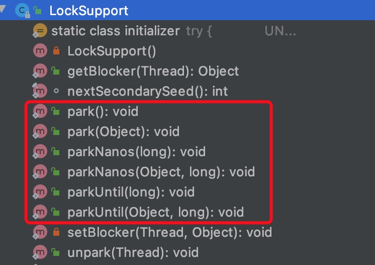
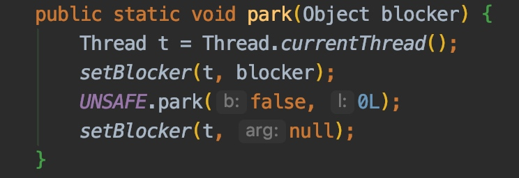
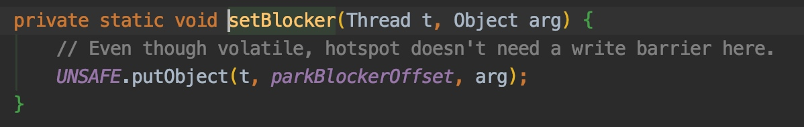
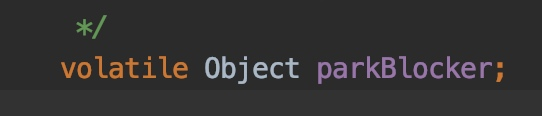
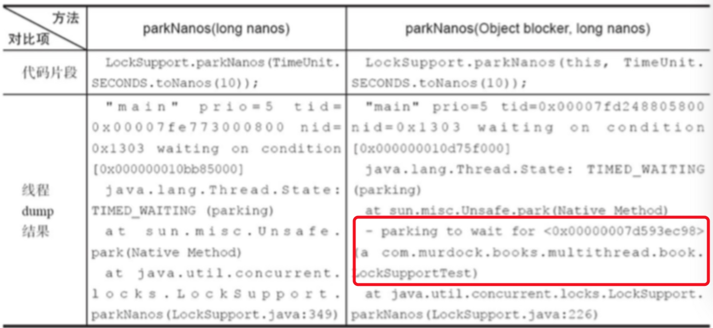

# Java同步机制(二)-LockSupport

LockSupport是AQS的实现中一个非常重要的部分，LockSupport提供了阻塞线程和唤醒线程的功能。
说到阻塞和唤醒，我们一定会想到wait/notify这两个方法。
和wait/notify相比，LockSupport有以下优点
- 以thread为操作对象更符合阻塞线程的直观定义（wait和notify都是针对锁对象的操作）
- 操作更精准，可以准确地唤醒某一个线程（notify随机唤醒一个线程，notifyAll唤醒所有等待的线程），增加了灵活性。

LockSupport是用来创建锁和其他同步类的基本线程阻塞原语。
LockSupport是Java并发包中很多并发工具控制机制的基础，它的底层是依赖Unsafe类实现，是直接调用native的本地方法。
下面我们会简单的分析一下LockSupport的使用方法、特点以及使用的注意事项。

##LockSupport中的方法
LockSupport中提供了一系列的`park`，`unpark`方法供我们进行挂起和唤醒。

### park和unpark


我们看到6个park方法，可以分为了3类分别是
- park() 一直阻塞
- parkNanos() 阻塞指定的纳秒数
- parkUntil() 阻塞到指定的时间，是时间的毫秒值

还有一个unpark方法
- unpark(Thread)  唤醒指定线程

### Blocker
然后每一类方法，都有一个带有Object参数的版本。比如park(Object)方法。

- 获得了当前线程，
- 然后把传入的对象，通过unsafe设置到Thread对象中的parkObject属性。


- 然后会调用unsafe的park方法挂起当前线程。
- 然后待线程被唤醒后，设置blocker为null

那设置和不设置的区别是什么呢?
这个Blocker对象是用来记录线程被阻塞时被谁阻塞的，主要用于线程监控和分析工具来定位原因的。



## LockSupport的使用

先用代码来展示一下LockSupport最简单的使用方式。

```java
@Test
public void testPark() throws InterruptedException {
    Object parkObject = new Object();
    Thread t1 = new Thread(() -> {
            long st = System.currentTimeMillis();
            System.out.println("t1调用park");
            LockSupport.park(parkObject);
            System.out.println("t1被唤醒了,阻塞了" + (System.currentTimeMillis() - st) + "ms");
        });

    t1.start();
    Thread.sleep(1000);
    Thread t2 = new Thread(() -> {
        System.out.println("t2调用unpark");
        LockSupport.unpark(t1);
    });
    t2.start();
}
```

执行结果是

```
t1调用park
t2调用unpark
t1被唤醒了,阻塞了1003ms
```

OK,其实上面的代码就能够展示出LockSupport的绝大部分场景的用法了。一个线程因为某些原因调用park方法阻塞，然后另一个线程在达到某些条件的时候，通过unpark唤醒这个线程。

在LockSupport的注释中有这么一句话

```
The
 * {@code park} method may also return at any other time, for "no
 * reason", so in general must be invoked within a loop that rechecks
 * conditions upon return.
```

简单翻译一下就是 
```
park 方法还可以在其他任何时间“毫无理由”地返回，
因此通常必须在重新检查返回条件的循环里调用此方法
```
所以在AQS对LockSupport.park()的使用中，都是放在一个循环中，每当

## 简单理解LockSupport阻塞的原理
下面来简单的理解一下LockSupport的原理。

每一个线程内部都有一个permit,许可证的概念
线程在初始化的时候，permit为0。
当在线程中调用LockSupport.park()方法的时候，会消耗掉一个permit。
- 如果此时线程中permit为0，线程就会挂起
- 如果此时permit为1，则park()方法会立刻返回，并消耗一个permit，线程内的permit变为0

调用LockSupport.unpark()方法的时候，会生产一个permit。如果该线程因为调用了park()方法而挂起，同时也会唤醒该线程。
- 不管调用多少次unpark,线程中permit的数量最多就是1。

通过上面描述，我们发现LockSupport的工作原理，很像一个信号量为1的Semaphore。
park为加锁，unpark为解锁。

## LockSupport和线程中断
除了unpark能唤醒park挂起的线程外，调用线程的`interrupt`方法也能唤醒线程。
对于`interrupt`方法，我们了解，
- 当一个线程处于sleep，或者wait的阻塞状态的时候。如果这个时候调用线程的`interrupt`方法，线程会抛出`InterruptedException`，并清除掉线程的中断状态。
- 如果线程处于运行状态，那么调用线程的`interrupt`方法，则不会发生任何异常，只会把线程的中断状态设置为true。
- 如果使用`interrupt`打断一个，通过park挂起的线程，线程会被唤醒，但是不会抛出异常，并且保留线程的中断状态。

而且如果一个线程的中断状态为true，就算没有permit，park()方法也会失效。
我们通过下面的代码来说明一下。

```java
@Test
    public void testInterruptAndPark() throws InterruptedException {
        Thread thread = new Thread(() -> {
            System.out.println("自己中断");
            Thread.currentThread().interrupt();

            System.out.println("打印线程中断状态：" + Thread.currentThread().isInterrupted());

            System.out.println("开始park");
            long st = System.currentTimeMillis();
            LockSupport.park();
            System.out.println("park结束,持续时间:" + (System.currentTimeMillis() - st));

            st = System.currentTimeMillis();
            LockSupport.park();
            System.out.println("park结束,持续时间:" + (System.currentTimeMillis() - st));
        });
        thread.start();
        Thread.sleep(100000);
    }

```
执行结果
```
自己中断
打印线程中断状态：true
开始park
park结束,持续时间:1
park结束,持续时间:0
```

我们在一个线程中，让它自己调用了interrupt方法，然后调用了两次park()方法，然后两次park()方法都失效了。
所以说线程的中断状态，会影响park()的挂起。

### JVM源码分析
