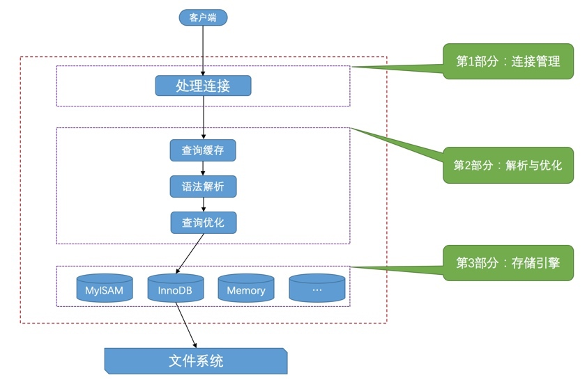
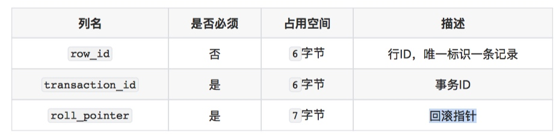

# MySQL相关知识

## MySQL执行流程



## 常用查询SQL

```
查询字符集
SHOW CHARACTER SET LIKE 'utf8';


```

## MySQL中的系统变量
为了解决不同数据库连接中对于系统变量的个性化需求，MySQL的设计者提出了变量的`作用范围`概念。分为
- `GOLBAL`全局变量，影响整体的服务器操作
- `SESSION`会话变量，只影响当前的数据库连接。

当一个数据连接建立的时候，会默认读取全局变量作为自己的会话变量。

### 修改系统变量
修改系统变量的方式主要有2中
1. 修改配置文件，通过配置修改的变量，作用范围都是全局变量。
2. 通过语法来设置，通过语法可以修改全局和会话变量，不过通过语法设置的全局变量在重启之后就会失效。

设置的语法是
`SET [GLOBAL|SESSION] 系统变量名 = 值;` 或者
`SET [@@(GLOBAL|SESSION).]var_name = XXX;`

举例说明一下

```
语句⼀：SET GLOBAL default_storage_engine = MyISAM;
语句⼆：SET @@GLOBAL.default_storage_engine = MyISAM;
```
当在一个数据库连接中修改系统变量的时候，如果不制定范围，则默认是修改会话变量。

## 数据库中的字符编码
### 比较规则
MySQL的比较规则，一般有几种结尾方式


### 修改字符集和排序规则
- 只修改字符集，则⽐较规则将变为修改后的字符集默认的⽐较规则。 
- 只修改⽐较规则，则字符集将变为修改后的⽐较规则对应的字符集。

### 字符集转换

- 客户端使⽤操作系统的字符集编码请求字符串，向服务器发送的是经过编码的⼀个字节串。 
- 服务器将客户端发送来的字节串采⽤ character_set_client 代表的字符集进⾏解码，将解 码后的字符串再按照 character_set_connection 代表的字符集进⾏编码。 
- 如果 character_set_connection 代表的字符集和具体操作的列使⽤的字符集⼀致，则直接 进⾏相应操作，否则的话需要将请求中的字符串从 character_set_connection 代表的字符集转换为具体操作的列使⽤的字符集之后再进⾏操作。 
- 将从某个列获取到的字节串从该列使⽤的字符集转换为 character_set_results 集后发送到客户端。 
- 客户端使⽤操作系统的字符集解析收到的结果集字节串。

通常为了减少无谓的字符集转换，就会把它们都设置为一样的

```
SET character_set_client = 字符集名; SET character_set_connection = 字符集名; SET character_set_results = 字符集名;
```

MySQL提供了一个语句，来同时设置这三个属性

```
SET NAMES 字符集名;
```

## InnoDB的存储结构
InnoDB在操作数据的时候，不是按照条，而是按照页来进行操作。在InnoDB中一个页的大小一般为16KB。
### 行格式

InnoDB中有四种行格式
- compact 紧凑 之前默认的行格式
- redundant 冗余
- Dynamic 5.7版本以后默认的行格式
- Compressed

### Compact行格式
整体可以分为
- 记录额外的信息
- 记录的正式信息

#### 行额外信息


- 首先最开始的部分是，记录可变字段的长度列表，按照所有可变长度在表中的顺序，倒序排列。每个字段的长度最小1个字节，最大2个字节，如果字段长度过长，会把超出的数据一道溢出页中，这个长度只计算留在本页的数据。
    - 采用1个字节还是2个字节的判断方式为
        - 可变字段的最大字符数M * 所在字符编码表示一个字符的最大字节数 N 如果结果小于255，则使用1个字节，否则使用2个字节
        - 例如utf8下的 字段 a 它的类型是varchar(8)
        - utf8在MySQL中表示一个字符最多可占用3个字节， 3*8 = 24，小于255，所以只需要一个字节来表示这个字段a的长度
    -   
-  接着是，该条记录中为Null的字段标识，也是按照字段的出现顺序倒序排列的，但是这里只会记录没有 标记为 not null的字段。
    -  每个字段使用1位来表示是否为null，1表示null，0表示不是null
    -  MySQL规定，这部分必须使用整数字节
        -  比如只有3个字段没有标识为not null，则前面5位需要使用0来填充
        -  如果有9个字段，则需要2个字节来表示，前7位用0来填充

        
#### 行真实信息
在真实信息中，除了我们自定义的列，MySQL还会给我们添加几个隐藏列，分别是



- row_id的作用是，当表没有指定主键，也没有唯一索引的时候，MySQL会创建row_id，并将其作为表的主键。