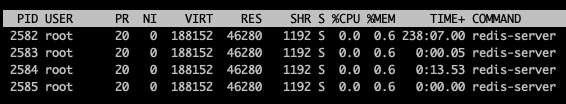

# Redis的线程
从接触到Redis开始，就了解到Redis的一个重要特性就是单线程。
带着这个特性，我通过命令`top -H -p 2582`查看了Redis Server内部开启的线程，发现Redis中并非只有1个线程，而是有4个。

这里面肯定有一主线程是负责Redis的操作的，那剩下的3个线程是负责什么的呢。

在Redis的初始化方法中，执行了这么一个方法`bioInit(); `

[Redis-Server 线程模型源码剖析](https://blog.icorer.com/index.php/archives/389/)