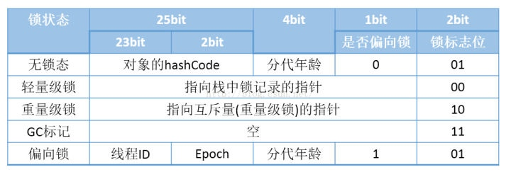

# 锁升级流程
```
synchronized(lock){
    ...
}

```

## 相关知识

* Java对象头



* 匿名偏向
    * 锁状态为偏向锁状态，但是没有偏向任何一个线程

* JVM中使用的CAS方法cmpxchg_ptr

```c
//构建一个匿名偏向的对象头
markOop header = (markOop) ((uintptr_t) mark & ((uintptr_t)markOopDesc::biased_lock_mask_in_place |(uintptr_t)markOopDesc::age_mask_in_place |epoch_mask_in_place));
//构建一个偏向当前线程的对象头
markOop new_header = (markOop) ((uintptr_t) header | thread_ident);
//执行CAS操作
if (Atomic::cmpxchg_ptr((void*)new_header, lockee->mark_addr(), header) == header) {
    //成功
}else{
    //失败
}
```
* cmpxchg_ptr这个方法的三个参数分别是
    * 第一个 字段变化的值 exchange value
    * 第二个 需要修改的字段地址 address
    * 第三个 比较值， compare value，也就是只有当字段是这个值的时候，才能发生交换。
* 根据上面的代码，的意思就是，如果锁对象的对象头的值为匿名偏向状态，那么把锁对象的对象头修改为偏向当前线程的对象头


## 偏向锁过程
1. 首先根据对象头的后三位判断该是不是处于偏向锁状态
    1. 如果是不是偏向状态则走轻量级锁流程
    2. 如果是偏向状态。
        1. 则拿到锁对象头中偏向的线程ID，判断是不是当前的这个线程。
            1. 如果是则不需要任何处理，认为获取锁成功
        2. 判断锁对象所属的类中的偏向锁是否开启
            1. 如果没有开启，则执行偏向锁撤销
        3. 判断锁对象的epoch和所属类型的epoch是否相同 
            1. 如果不同，则尝试重偏向  （TODO 这里为什么）
                1. 如果偏向失败则进行锁升级
        4. 这时候通过CAS，把当前线程的ThreadID设置到锁对象头中。（走到这一步说明要么是匿名偏向状态，要么偏向其他线程）
            1. 如果设置成功，表示获取偏向锁成功
            2. 如果设置失败，表示已经排向了其他线程，则进行锁升级。

## 轻量级锁过程
当上面的偏向锁获取失败的时候，会升级到轻量级锁。
这时候锁对象的对象头格式也会发生相应的变化，在锁对象的对象头中，会存储一个指向持有锁的线程的线程栈中的一个Lock Record的指针。
被Lock Record指针锁顶替的对象头中其他字段的信息，为在Lock Record中存储。

```c++
CASE(_monitorenter): {
  oop lockee = STACK_OBJECT(-1);
  ...
  if (entry != NULL) {
   ...
   // 上面省略的代码中如果CAS操作失败也会调用到InterpreterRuntime::monitorenter

    // traditional lightweight locking
    if (!success) {
      // 构建一个无锁状态的Displaced Mark Word
      markOop displaced = lockee->mark()->set_unlocked();
      // 设置到Lock Record中去,对象头中的其他信息，存储到Lock record中了
      entry->lock()->set_displaced_header(displaced);
      bool call_vm = UseHeavyMonitors;
      if (call_vm || Atomic::cmpxchg_ptr(entry, lockee->mark_addr(), displaced) != displaced) {
        // 如果CAS替换不成功，代表锁对象不是无锁状态，这时候判断下是不是锁重入
        // Is it simple recursive case?
        if (!call_vm && THREAD->is_lock_owned((address) displaced->clear_lock_bits())) {
          entry->lock()->set_displaced_header(NULL);
        } else {
          // CAS操作失败则调用monitorenter
          CALL_VM(InterpreterRuntime::monitorenter(THREAD, entry), handle_exception);
        }
      }
    }
    UPDATE_PC_AND_TOS_AND_CONTINUE(1, -1);
  } else {
    istate->set_msg(more_monitors);
    UPDATE_PC_AND_RETURN(0); // Re-execute
  }
}


```

1. 构建一个无锁状态的对象头，(也就是把对象头的后三位设置为001，其他位不变)
2. 把对象头设置到之前创建的Lock Record中，也就是把对象头中的信息保存到Lock Record中。
3. 判断是否有UseHeavyMonitors参数，如果有，则直接走重量级锁
4. 使用CAS操作，把Lock Record的地址，设置到锁对象的对象头中。
    1. 如果CAS成功，则表示获取成功，则结束
    2. 如果CAS失败，则表示当前已经有线程轻量级锁定了这个对象
        1. 需要判断是不是当前线程，如果是当前线程则表示是重入
        2. 