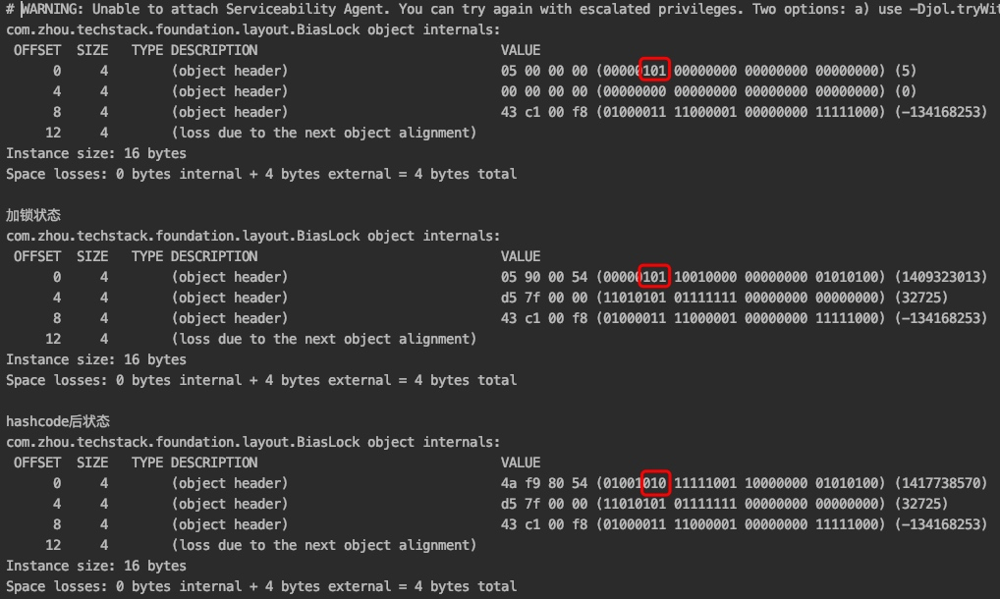

# 

| 名称 | 作用 |
| --- | --- |
| _header | 保存锁对象的对象头markoop |
| _object | 锁对象 |
| _owner | 持有重量级锁的线程的Lock Reord |
| _recursions | 重量级锁的重入次数 |
| _EntryList | 被阻塞的线程重新进入时，会将其放在当前队列中。其实这个队列是被wait()方法阻塞的线程，当调用notify/notifyAll时，会将准备唤醒的线程放在这个队列中。 |
| _cxq |  当对象锁已经被一个线程持有，其他所有的线程在尝试获取锁的时候，如果没有获取到，将其挂起后都会被放在这个队列上。 |
| _WaitSet | 调用wait()方法阻塞的线程，都会放在当前队列中 |

