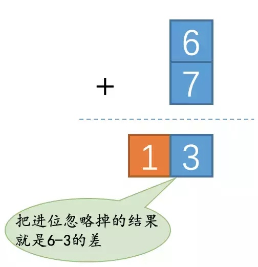

[toc]
# 模运算、余数、补数
在计算机中，模运算是一个很重要的运算方式。我们熟知的早期版本的JDK中，HashMap计算key位置，就是用的取模运算。

模运算在数学中记做 `mod`。

##计算
$a \bmod b$  就是计算 a 除以 b 的余数.
如果 $a \bmod b$ = 0，那我们就说a可以被b整除。

```
7 mod 12 = 7

5 mod 12 = 5

24 mod 12 = 0

```

上面是我们常见的正数求余的算法，那如果是负数求余呢

## 负数求余
其实不管是正数还是负数，我们都可以根据一个公式来计算余数。
$a \bmod b$ = $a - (\lfloor a/b \rfloor* b)$
公式中的这个符号叫做取下界(floor),就是代码中常用的floor函数,是向下取整的意思是。含义就是如果是一个小数，就取第一个比它小的整数。举例说明一下
* $\lfloor 2.3 \rfloor$ = 2
* $\lfloor -2.3 \rfloor$ = -3

```
7 mod 12 = 7 - (0 * 12) = 7
5 mod 12 = 5 - (0 * 12) = 5
23 mod 12 = 24 - (2 * 12) = 0
-5 mod 12 = -5 - (-1 * 12) = -5 + 12 = 7
```

## 同余
在上面的例子中我们看到 7 mod 12 和 -5 mod 12 的结果都是 7，那我们就可以说 7和-5在模为12的时候，同余。用数学公式表达出来就是 
$7\equiv -5 \pmod {12}$

### 同余的理解
ok，现在我们知道了7和-5是对12同余的，那它又有什么作用呢；
一个简单并且经典的解释就是钟表，因为钟表就可以认为是一个模为12的计算系统。
如果7 和 -5 同余，使用钟表解释就是，在钟表的任意位置向前拨7个小时，和向后拨5个小时，得到的结果都是一样的。

## 补数
在我简单来理解就是如果两个正数  A + B = 模，那么久可以说A和B互为补数。
那么在这个模下， X-A 就等价于 X+B
### 补数的计算方法
计算公式是:$b^n - a$
其中b表示是这个数字是几进制的，n表示位数，a表示要计算补数的数

比如我们要求 10进制下的5的补码，并且假定是3位的10进制表示方法，那么他的补数就是
$10^3 - 5$ 
```
   1 000
-      5
---------------
     995
```
这里面会有一个问题就是计算的时候需要借位，我们可以改一下，使用如下方式
```
     999
  -    5
  ---------------  
     994            + 1 =   995
```
因为10进制的最大数就是9，所以使用这样肯定不会发生借位的情况，算是解决掉了借位的问题，简化了运算。

### 利用补数将减法转换为加法
我们现在也知道了一个数的补数该如何更快的计算出来，不过引入这个补数的概念有啥用呢？哈哈，它就是解决减法问题的关键。比如我们在使用1个十进制位表示数字的时候，3和7互为补数。假设现在我们想计算`6 - 3`的值，那我们可以这样转换这个表达式：
```
6 - 3 = 6 - (10 - 7)
      = 6 + 7 - 10
```
也就是说：在做只使用1个十进制位表示的数字之间的减法操作时，减去一个数等于加上这个数的补数然后再减去10，减去10的操作其实就相当于直接把和的进位忽略掉，得到的就是原减法的结果。6 + 7的和是13，如果我们直接忽略掉进位，那么结果就成了3，它其实就是6 - 3的结果。如图所示：



更一般地，假设y、$\overline{y}$是两个使用n个十进制位表示的数字，它们互为补数，那么我们有：
$y + \overline{y} = 10^n$
也就可以推出：
$y  = 10^n -  \overline{y}$
那么假设也是使用n个十进制位表示的数字，那么我们有：
$x -y = x - (10^n - \overline{y} ) = x + \overline{y} - 10^n$
也就是说：在做使用n个十进制位表示的数字之间的减法操作时，减去一个数等于加上这个数的补数然后再减去$10^n$，减去$10^n$的操作其实就相当于直接把和的进位忽略掉，得到的就是原减法的结果。


## 参考
[同余定理](https://baike.baidu.com/item/%E5%90%8C%E4%BD%99%E5%AE%9A%E7%90%86/1212360?fromtitle=%E5%90%8C%E4%BD%99&fromid=1432545)
[补数](https://zh.wikipedia.org/wiki/%E8%A1%A5%E6%95%B0)
[补数到底是个什么玩意儿？从根儿上理解一下](https://mp.weixin.qq.com/s/osV5nSWMXLzF4LRjDGsHbw)
