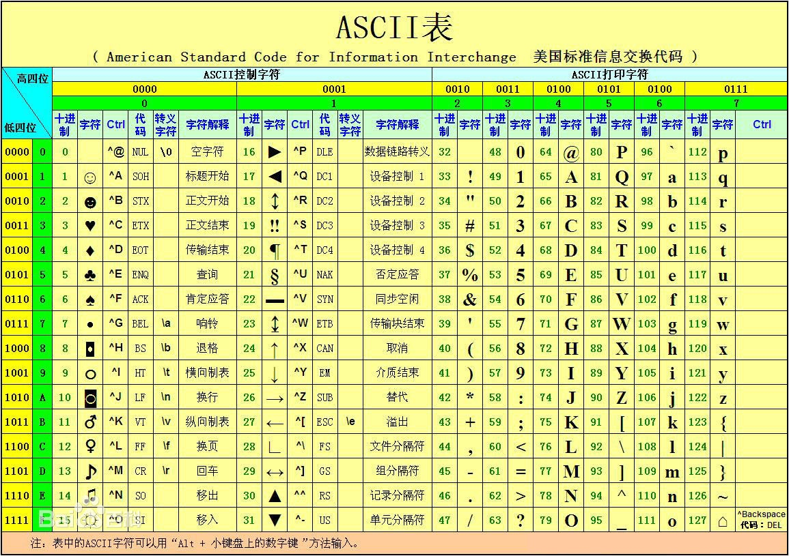
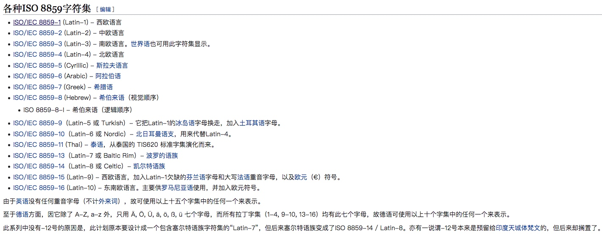
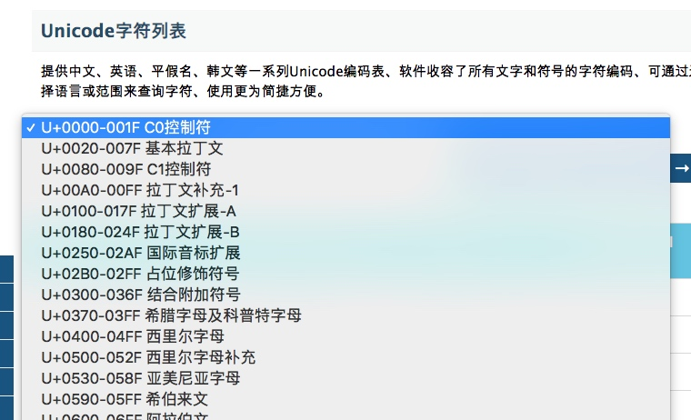

# 字符编码整理

字符编码是我们在开发过程中无法逃避的问题，经常遇到各种各样的乱码。通常我们会在几个地方设置一下字符编码方式，然后乱码解决了，然后就会把字符编码放到一边，很少有机会或者会想到去专门系统的了解一下字符编码知识。

我之前也写过一些编码的文章，但是回过头在去看的时候，发现这也不对，那也不对，主要就是因为当时了解的比较片面。这次希望能够把常见的几种编码，和在编程中常见的编码问题搞清楚。

## 字符编码和字符集
- 字符集
字符集的意思就是所有字符的集合，并且每一个字符都有一个唯一的编号。
- 字符编码
字符编码就是把字符集内字符的编号转换成二进制数据的一种规则。

所以说字符集和字符编码并不是一个东西，字符编码需要依赖于字符集。但是大多数字符编码的名称就是它对应字符集的名称，比如 
- ASCII字符集和ASCII字符编码
- GBK字符集和GBK字符编码

但是有一个例外就是基于Unicode字符集的UTF系列的字符编码，这个我们后面会重点说。
下面简单介绍几个我们比较熟悉的字符集，不会详细讨论设计细节，如果大家有需要可以去查看字符集的维基百科。后面后给出链接。

### ASCII
ASCII可以认为是最早的字符集，它定义了128个字符，其中包括32个不可见字符(比如一些控制字符 换行，回车等)，还有96个可见字符(大写小写字母，标点符号等)。

ASCII的字符编码也比较简单，就是用二进制来表示字符的序号，因为它一共只有128个，所以只需要用到一个字节的后7位。

[ASCII维基百科](https://zh.wikipedia.org/wiki/ASCII)

### ISO 8859-1
ISO 8859-1 这个也是我们很熟悉的字符集，这个字符集是以ASCII为基础，并扩充了一些拉丁字母，也被叫做Latin-1字符集。
因为拉丁国家众多，有很多国家都对这个字符集进行了修改或者扩充。

虽然有这么多的字符集，但是他们有一个共同点，他们都是采用的单字节的编码方式。

[ISO-8859-1维基百科](https://zh.wikipedia.org/wiki/ISO/IEC_8859)

### GBK
GBK的全称是汉字内码扩展规范。
其中
- GB是国标的首字母
- K 是扩展的首字母

GBK的其他信息，我们不做太多说明，有兴趣的可以去维基百科查看

[GBK维基百科](https://zh.wikipedia.org/wiki/Gbk)

#### GBK的编码方式
GBK分为单字节和双字节编码，单字节编码兼容ASCII字符集。

这张图片是GBK的编码分区图。
- 首字节 0-128(不包括128)，都是单字节的编码区域
- 首字节 128-255，第二字节 0-64，这部分区域没有字符，如果出现在这个区域，会被解析为`�`
- 首字节 128-255，第二字节 64-255，这部分主要是中文符号。

根据上面的编码分区图，我们可以知道GBK是如何区分一个字节是是单字节编码，还是双字节编码的第一个字节，这个很重要，在下面乱码的解析中，我们会分析。
- 如果小于128，则表示是单字节编码
- 如果大于128，则表示是双字节编码

### Unicode
因为世界上的国家有很多，使用的语言和文字也大相径庭，每个国家都有自己使用的字符集和编码，所以有必要使用一个统一的字符集来解决字符集分裂的问题。Unicode就是为了解决这个问题而诞生的。

Unicode中，是为每种语言都分配了一个区域，并且可以说是涵盖了世界上的所有的字符。

- 比如Unicode中的前128个字符和ASCII中的字符位置保持一致。
- 比如中文在Unicode的位置是 4E00-9FFF (19968-40959)

[Unicode字符列表](https://www.ltool.net/characters-to-unicode-charts-in-simplified-chinese.php)

####基于Unicode字符集的字符编码
Unicode字符集使用4个字节来表示字符。

